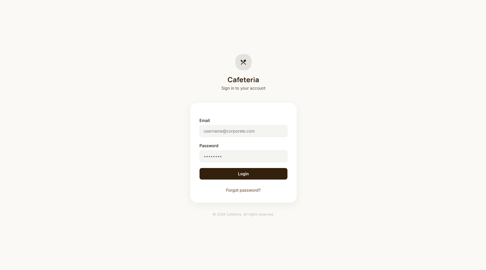
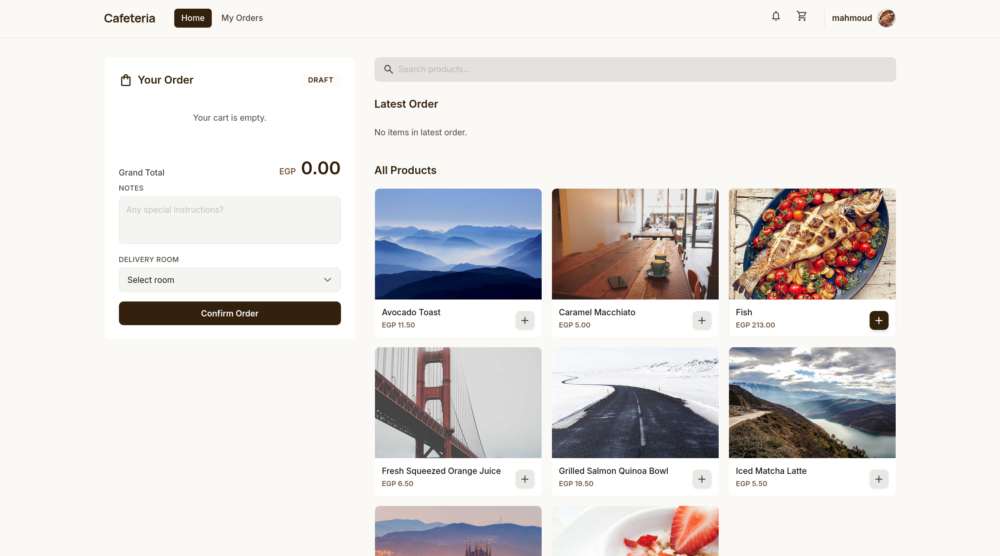
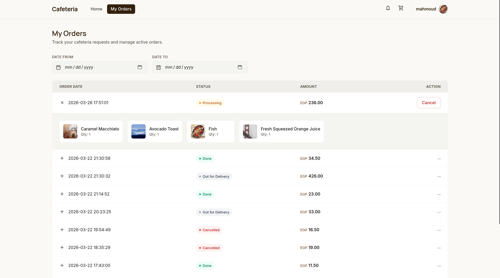
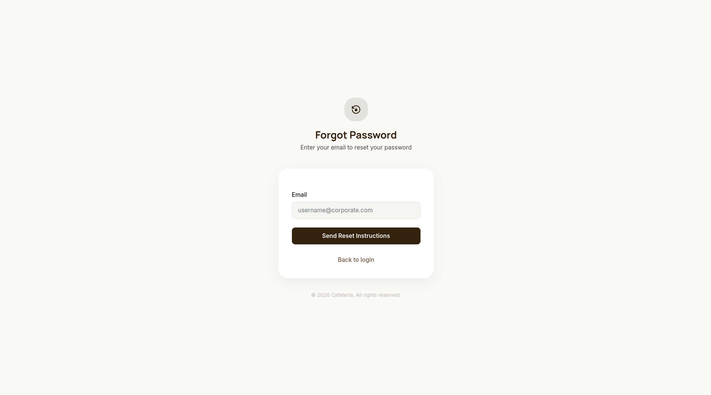
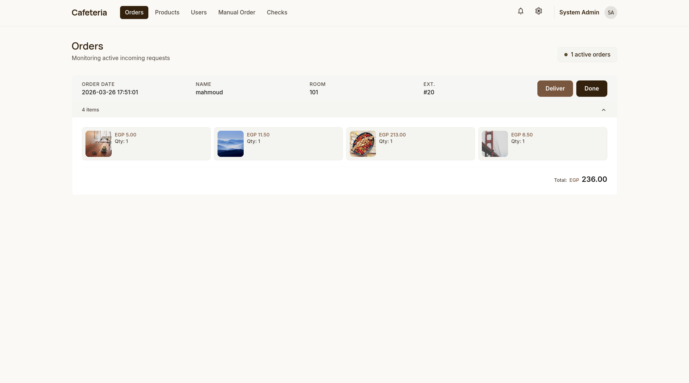
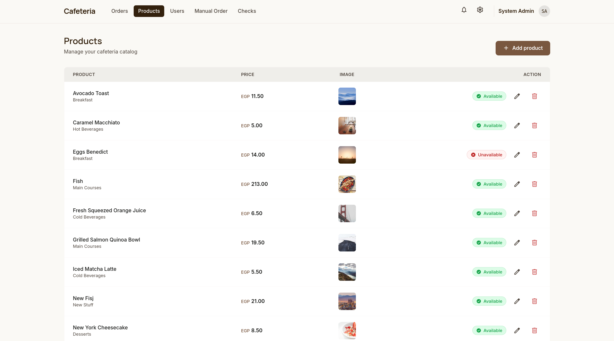
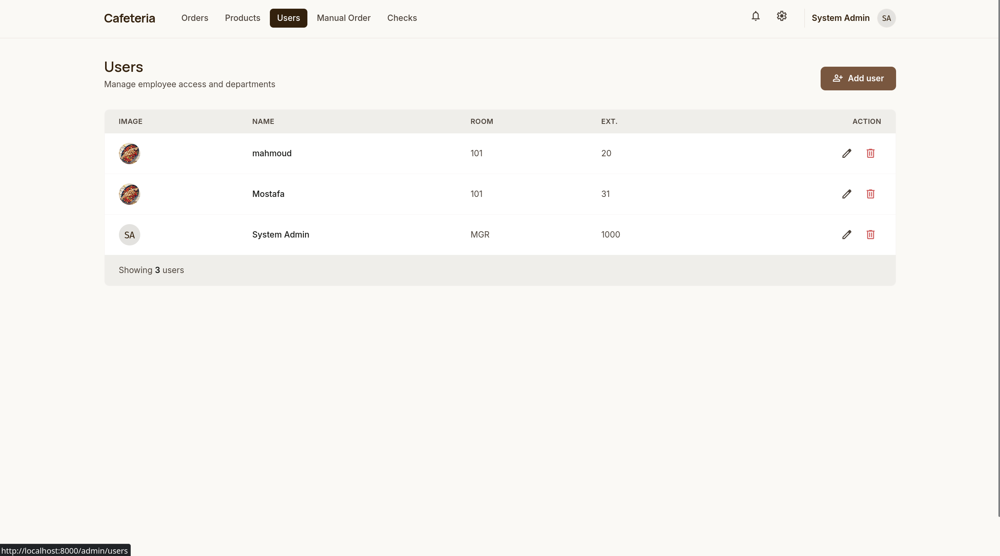
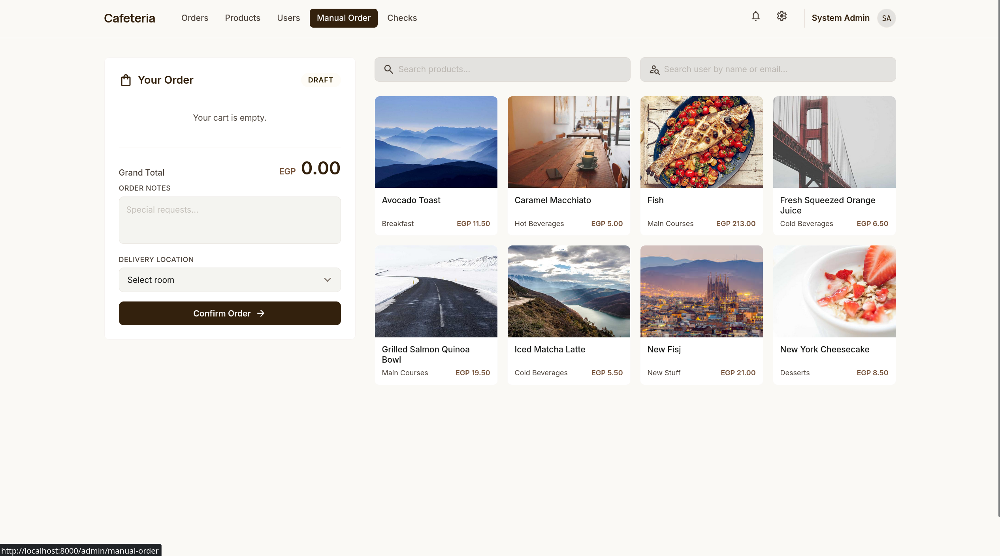
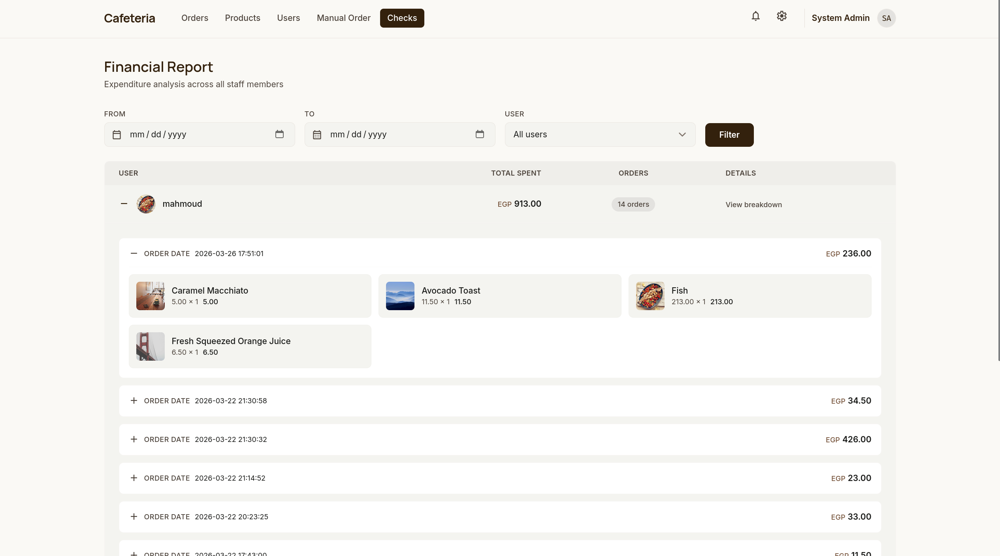
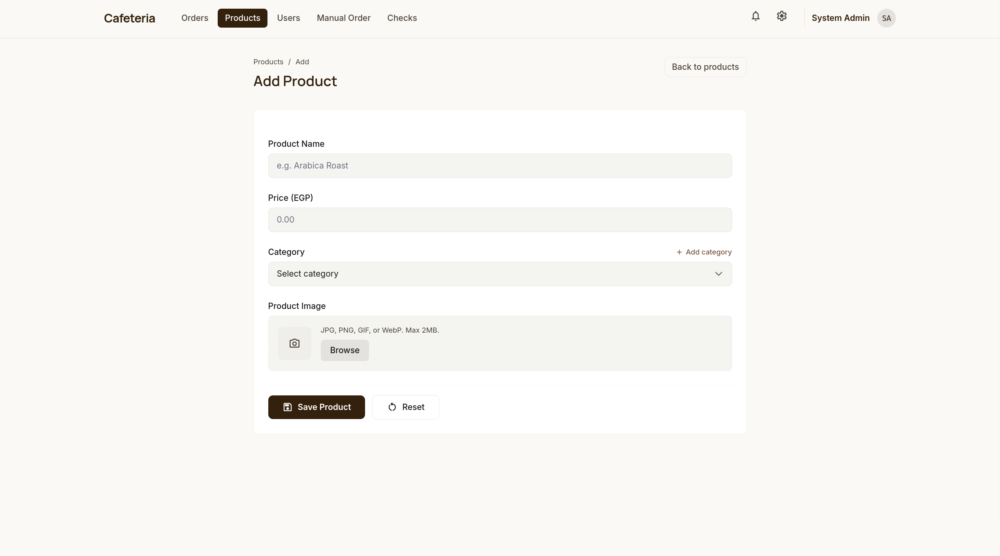

<div align="center">

# Cafeteria

**An internal cafeteria ordering and management system for corporate offices.**

[](https://www.php.net/)
[](https://www.mysql.com/)
[](https://tailwindcss.com/)
[](LICENSE)
[]()

</div>

---

## Screenshots / UI Preview

### User Panel

<table>
  <tr>
    <td align="center"><br /><em>Login — Email and password authentication with forgot-password support</em></td>
    <td align="center"><br /><em>User Home — Browse products, build a cart, and place orders to a room</em></td>
  </tr>
  <tr>
    <td align="center"><br /><em>My Orders — Full order history with status tracking, date filters, and expandable item details</em></td>
    <td align="center"><br /><em>Forgot Password — Email-based account recovery flow</em></td>
  </tr>
</table>

### Admin Panel

<table>
  <tr>
    <td align="center"><br /><em>Admin Orders — Monitor incoming requests with Deliver / Done actions and item breakdowns</em></td>
    <td align="center"><br /><em>Products Management — Full product catalog with availability toggle, edit, and delete</em></td>
  </tr>
  <tr>
    <td align="center"><br /><em>Users Management — View and manage employees with room assignments and extensions</em></td>
    <td align="center"><br /><em>Manual Order — Place orders on behalf of any employee with user search</em></td>
  </tr>
  <tr>
    <td align="center"><br /><em>Financial Report (Checks) — Expenditure analysis with date/user filters and nested order breakdowns</em></td>
    <td align="center"><br /><em>Add Product — Create products with name, price, category, and image upload</em></td>
  </tr>
</table>

---

## Features

### User Panel

- **Product Browsing** — View available menu items with images, names, prices, and categories
- **Live Search** — Filter products in real time by name
- **Cart Management** — Add items, adjust quantities with +/− controls, remove with ✕, view running total (EGP)
- **Room Selection** — Choose a delivery room from a dropdown before confirming
- **Order Notes** — Attach special instructions (e.g., "1 Tea Extra Sugar")
- **Order Confirmation** — Submit the cart as a new order in one click
- **Latest Order Widget** — Quick-reference card showing the most recent order on the dashboard
- **Order History** — Paginated table with Order Date, Status, Amount, and Action columns
- **Order Status Tracking** — Visual indicators for Processing, Out for Delivery, Done, and Cancelled
- **Cancel Orders** — Cancel an order while it is still in "Processing" status
- **Date Filtering** — Filter order history by "Date From" and "Date To"
- **Expandable Order Details** — Click the + icon to reveal the exact items and quantities in any order

### Admin Panel

- **Incoming Orders Dashboard** — Real-time view of active orders with user name, room, Ext., and total amount
- **Deliver / Done Actions** — Transition orders from Processing → Out for Delivery → Done
- **Expandable Item Breakdown** — View exact product images, quantities, and prices per order
- **Manual Order** — Place orders on behalf of any employee using a searchable user dropdown
- **Product CRUD** — Create, edit, and delete products with name, price (EGP), category, and image upload
- **Availability Toggle** — Mark products as Available or Unavailable without deleting them
- **Inline Category Creation** — Add new product categories on the fly from the product form
- **User CRUD** — Create, edit, and delete employee accounts with name, email, password, room, Ext., and profile picture
- **Financial Checks** — Filter expenditure reports by date range and specific user
- **Spending Summary** — Per-user totals with order count and drill-down to individual orders
- **Nested Report Expansion** — Expand a user → see their orders → expand an order → see item-level breakdown

---

## Tech Stack

| Category | Technology | Purpose |
|---|---|---|
| Backend | PHP 8.x | Server-side logic, custom router, session management |
| Database | MySQL 8.0 | Relational data storage with InnoDB and foreign keys |
| Frontend | TailwindCSS 3.x (CDN) | Utility-first responsive styling |
| Interactivity | Vanilla JS / Fetch API | AJAX cart updates, live search, order expansion |
| Auth | PHP Sessions | Role-based access control (Admin / User) |
| Security | CSRF Tokens | POST/PUT/DELETE request protection |
| Images | PHP File Upload | Product and profile picture handling (max 2 MB) |
| Environment | `.env` file | Database credentials and app configuration |

---

## Database Schema

```sql
users         (id, name, email, password, room_no, ext, profile_pic, role_id, is_active, created_at)
categories    (id, name)
products      (id, name, price, image, category_id, is_available)
rooms         (id, room_number)
orders        (id, user_id, room_no, notes, total_amount, status, created_at)
order_items   (id, order_id, product_id, quantity, price_at_time_of_order)
```

**Key constraints:**
- `orders.status` is an ENUM: `Processing`, `Out for Delivery`, `Done`, `Cancelled`
- `order_items.price_at_time_of_order` captures the price at checkout time (immutable)
- Foreign keys enforce referential integrity with `ON DELETE RESTRICT` / `CASCADE` as appropriate
- Indexes on `orders.user_id`, `orders.status`, and `orders.created_at` for query performance

---

## Getting Started

### Prerequisites

- **PHP** >= 8.0
- **MySQL** >= 8.0 or MariaDB >= 10.4
- A local server environment — [XAMPP](https://www.apachefriends.org/), [Laragon](https://laragon.org/), [WAMP](https://www.wampserver.com/), or PHP's built-in server
- **Git** for cloning

### Installation

1. **Clone the repository**

   ```bash
   git clone https://github.com/your-username/cafeteria.git
   cd cafeteria
   ```

2. **Create the database**

   ```bash
   mysql -u root -p -e "CREATE DATABASE cafeteria CHARACTER SET utf8mb4 COLLATE utf8mb4_unicode_ci;"
   ```

3. **Configure environment variables**

   Copy the example and fill in your database credentials:

   ```bash
   cp .env.example .env
   ```

   Edit `.env`:

   ```env
   APP_NAME="Cafeteria Management System"
   BASE_URL="http://localhost:8000"

   DB_HOST=localhost
   DB_NAME=cafeteria
   DB_USER=root
   DB_PASS=
   DB_CHARSET=utf8mb4
   ```

4. **Run database migrations and seeders**

   ```bash
   php database/setup_db.php
   ```

   This executes all migration files in order and seeds the default admin account and room data.

5. **Start the development server**

   ```bash
   php -S localhost:8000 -t public
   ```

6. **Open the app**

   Navigate to [http://localhost:8000](http://localhost:8000) in your browser.

---

## Configuration

The application reads configuration from environment variables (`.env`), falling back to sensible defaults:

```php
// config/database.php
define('DB_HOST', getenv('DB_HOST') ?: 'localhost');
define('DB_NAME', getenv('DB_NAME') ?: 'cafeteria');
define('DB_USER', getenv('DB_USER') ?: 'root');
define('DB_PASS', getenv('DB_PASS') ?: '');
define('DB_CHARSET', getenv('DB_CHARSET') ?: 'utf8mb4');
```

```php
// config/app.php
define('APP_NAME', getenv('APP_NAME') ?: 'Cafeteria Management System');
define('BASE_URL', getenv('BASE_URL') ?: '');
define('UPLOAD_MAX_SIZE', 2 * 1024 * 1024); // 2 MB
```

---

## User Roles & Access

| Page | User (Employee) | Admin |
|---|:---:|:---:|
| Home / Order | ✅ | ❌ |
| My Orders | ✅ | ❌ |
| Admin Orders Dashboard | ❌ | ✅ |
| Products Management | ❌ | ✅ |
| Users Management | ❌ | ✅ |
| Manual Order | ❌ | ✅ |
| Financial Checks | ❌ | ✅ |

- **Users** (`role_id = 2`) are redirected to `/dashboard` after login
- **Admins** (`role_id = 1`) are redirected to `/admin/orders` after login
- Route-level middleware (`AuthMiddleware`, `AdminMiddleware`) enforces access control on every request

---

## Project Structure

```
cafeteria/
├── app/
│   ├── Controllers/
│   │   ├── Admin/
│   │   │   ├── AdminOrderController.php
│   │   │   ├── CheckController.php
│   │   │   ├── ManualOrderController.php
│   │   │   ├── ProductController.php
│   │   │   └── UserController.php
│   │   ├── AuthController.php
│   │   ├── BaseController.php
│   │   ├── CartController.php
│   │   ├── DashboardController.php
│   │   └── OrderController.php
│   ├── Models/
│   │   ├── Category.php
│   │   ├── Order.php
│   │   ├── OrderItem.php
│   │   ├── Product.php
│   │   ├── Room.php
│   │   └── User.php
│   ├── Services/
│   │   ├── Contracts/           # Service interfaces
│   │   ├── AuthService.php
│   │   ├── CartService.php
│   │   ├── CheckService.php
│   │   ├── FileUploadService.php
│   │   ├── ManualOrderService.php
│   │   ├── OrderService.php
│   │   ├── ProductService.php
│   │   └── UserService.php
│   ├── Views/
│   │   ├── admin/
│   │   │   ├── products/        # index.php, form.php
│   │   │   ├── users/           # index.php, form.php
│   │   │   ├── checks.php
│   │   │   ├── manual_order.php
│   │   │   └── orders.php
│   │   ├── auth/
│   │   │   ├── login.php
│   │   │   └── forget_password.php
│   │   ├── layouts/             # app.php, auth.php
│   │   ├── partials/            # head, headers, cart widget, pagination, toast
│   │   └── user/
│   │       ├── dashboard.php
│   │       └── orders.php
│   └── Router.php               # Singleton router with GET/POST support
├── config/
│   ├── app.php                  # App name, base URL, upload limits
│   ├── database.php             # PDO connection factory
│   └── routes.php               # All route definitions with middleware
├── database/
│   ├── migrations/              # 7 sequential SQL migration files
│   ├── seeders/                 # Admin account + room data seeders
│   ├── schema.sql               # Full schema reference
│   └── setup_db.php             # Migration runner script
├── helpers/
│   ├── csrf.php                 # CSRF token generation and verification
│   └── functions.php            # Global utility functions
├── middleware/
│   ├── AdminMiddleware.php      # Restricts routes to role_id = 1
│   └── AuthMiddleware.php       # Requires authenticated session
├── public/
│   ├── assets/
│   │   ├── css/                 # style.css, components.css
│   │   └── js/                  # app.js, cart.js, search.js, orders.js, admin/
│   ├── uploads/
│   │   ├── products/            # Uploaded product images
│   │   └── profiles/            # Uploaded profile pictures
│   └── index.php                # Application entry point (front controller)
├── logs/
│   └── error.log                # Application error log
├── screenshots/                 # UI screenshots for documentation
├── docs/                        # Project requirements & SRS documents
├── design/                      # Wireframes (PDF)
├── .env                         # Environment configuration (git-ignored)
├── .gitignore
└── README.md
```

---

## Order Status Flow

```
[Processing] ──────► [Out for Delivery] ──────► [Done]
      │
      └──► [Cancelled]  ← User can cancel only while Processing
```

- **Processing** — Order placed, waiting for the cafeteria to prepare it
- **Out for Delivery** — Admin clicked "Deliver"; order is on its way to the room
- **Done** — Admin clicked "Done"; order has been delivered
- **Cancelled** — User cancelled the order before it left Processing

---

## Contributing

Contributions are welcome! This is an internal company tool, but external contributions for learning and improvement are appreciated.

1. **Fork** the repository
2. **Create** a feature branch

   ```bash
   git checkout -b feature/your-feature-name
   ```

3. **Commit** your changes with clear messages

   ```bash
   git commit -m "feat: add order notification system"
   ```

4. **Push** to your fork

   ```bash
   git push origin feature/your-feature-name
   ```

5. **Open a Pull Request** against `main`

### Branch Naming Convention

- `feature/feature-name` — New features
- `fix/issue-description` — Bug fixes
- `docs/description` — Documentation updates

---

## License

This project is licensed under the **MIT License**. See the [LICENSE](LICENSE) file for details.
